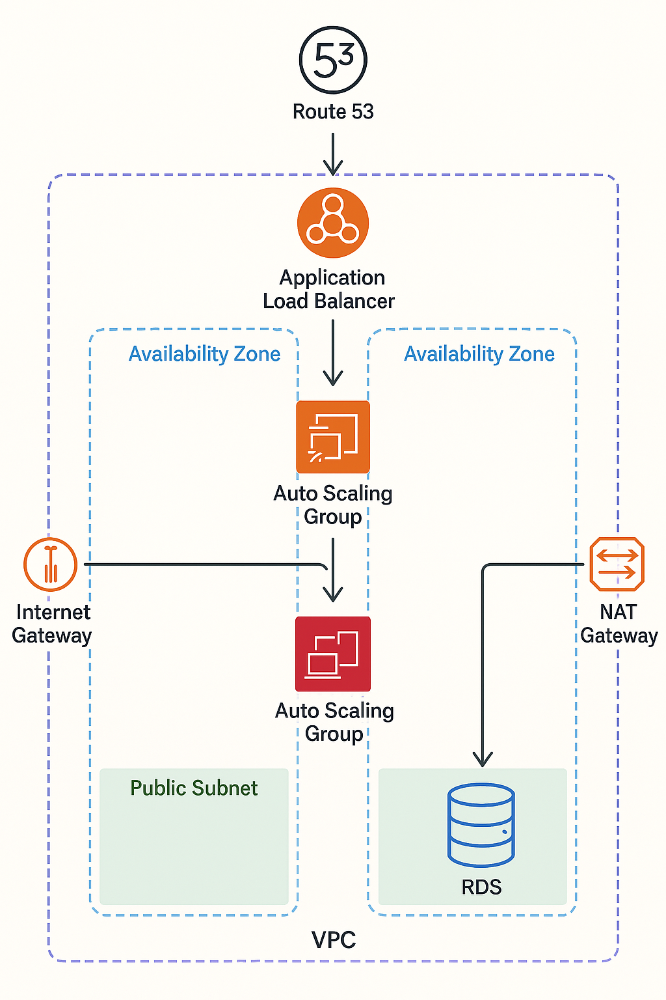

# Scalable Web Application with Auto Scaling & Load Balancing

Scenario: Host a dynamic web app (e.g., a blog or e-commerce site) that automatically scales based on traffic.

Services Used:
1. EC2 (Auto Scaling Group, Launch Templates)
2. Application Load Balancer
3. RDS (MySQL/PostgreSQL)
4. S3 (for static content)
5. Route 53 (DNS)
6. CloudWatch (Monitoring)

Add Complexity:

1. Use CloudFront for caching
2. Deploy app updates using CodeDeploy with Blue/Green deployment

